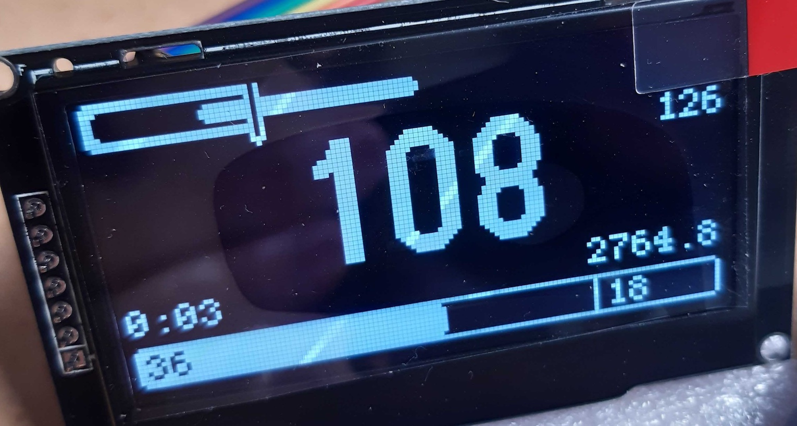
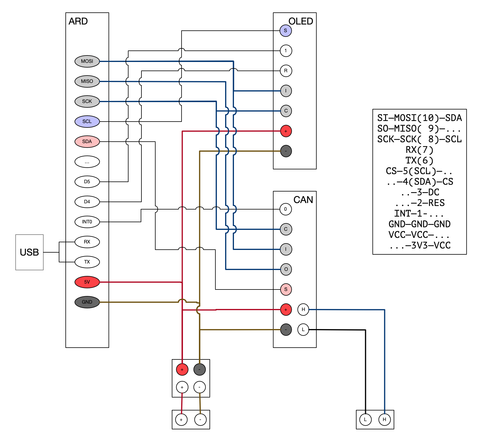

# VW Head-Up Display

A self-built Head-Up Display for a VW Sharan (Sound, TSI 1.5, 2018, manual gearbox, platform PQ). It taps the car's **native CAN bus** — not OBD-II — and decodes raw frames (RPM, speed, fuel, gear, ignition) against `opendbc/vw_pq.dbc`, then renders a driving page and an idle page on a 128x64 OLED. Swappable backends (`CarEvent` source / `Hudisplay` renderer / `Workflow` state machine / `PowerManager`) keep it portable across boards and bench-testable.

- Live demo / simulator: [hud-simulator.html](https://1e1.github.io/arduino-obd2-hud/hud-simulator.html)
- Design doc: [doc/DESIGN.md](./doc/DESIGN.md)

## Wiring

The OLED and the MCP2515 share the SPI bus (SCK / MOSI / MISO); each has its own chip-select. Pins below are the classic Nano block from [`vw-hud/_wiring.h`](./vw-hud/_wiring.h).

| Signal | Pin |
|---|---|
| SCK | D13 |
| MOSI | D11 |
| MISO | D12 |
| MCP2515 CS | D9 |
| OLED CS | D8 |
| OLED DC | D5 |
| OLED RESET | D4 |
| MCP2515 INT | D2 |

## CAN exploration

Signal discovery / reverse-engineering is done in the companion project **[discodb2](https://github.com/1e1/discodb2)** — a read-only (listen-only) toolkit that streams and decodes the bus from a laptop or Pi via a USB CAN adapter, with a zero-hardware simulator.

## hardware

- Arduino Nano classic / Uno (ATmega328P @16 MHz, 32 KB ROM / 2 KB RAM) — the boards the firmware builds for today
- MCP2515 CAN board (SPI) — crystal frequency must be declared in code (8 or 16 MHz per module)
- SSD1309 128x64 OLED (SPI)
- DCC 12V→5V converter

Other target boards (Nano Every, XIAO SAMD21, XIAO ESP32-C3, RP2040 Pico, CANBed RP2040) need a `PowerManager` port and are listed in [doc/DESIGN.md](./doc/DESIGN.md).
