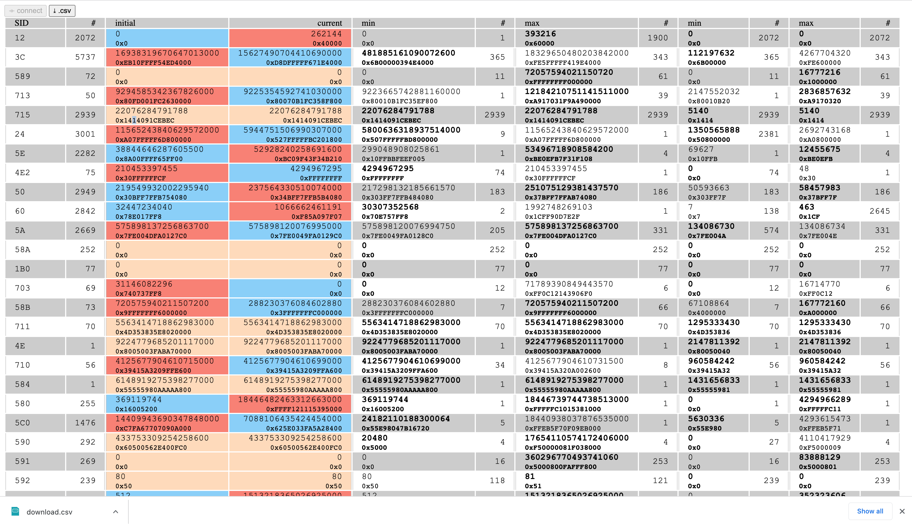

# VW Head-Up Display

## tool

- Flash `./scan/scan.ino`
- Open `./www/index.htm` on Chrome (require the [Web Serial API](https://developer.mozilla.org/en-US/docs/Web/API/Web_Serial_API))
- Plug the sketch on the car and on the computer
- Click on Connect then start your car

## hardware

- Arduino Nano Every
- board MCP2515 SPI
- board LCD 128x64 SPI
- DCC 12V-5V converter

